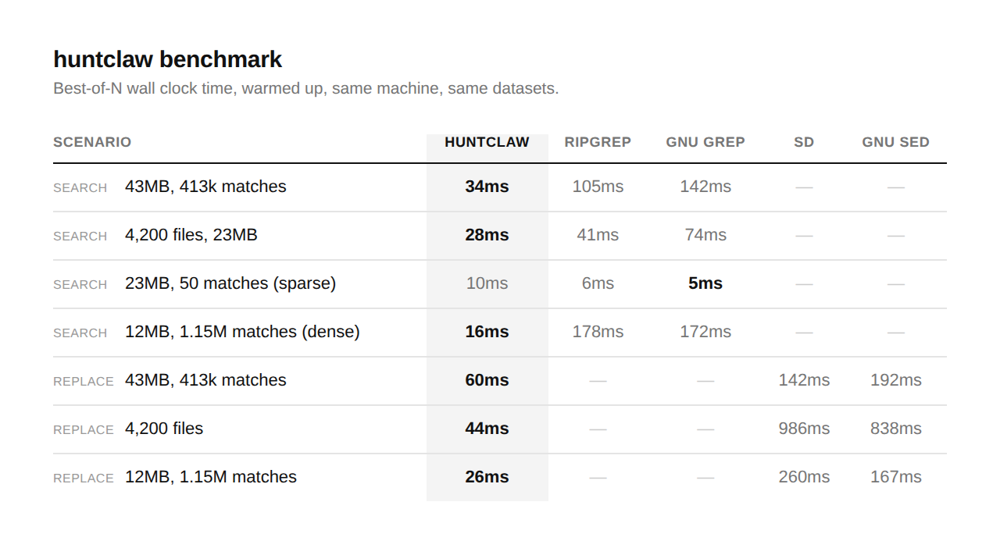

# huntclaw

A find-and-replace utility with one goal: be the fastest thing you can run for
this job. Not the most features, not the prettiest output — speed. Everything
else is secondary.

Written in Zig, no runtime, no dependencies, ~260KB binary.

## Build

Requires Zig 0.16.0.

```
pip install ziglang --break-system-packages
python3 -m ziglang build --release=fast
```

The binary lands at `zig-out/bin/huntclaw`. For a Windows build from Linux/macOS:

```
python3 -m ziglang build --release=fast -Dtarget=x86_64-windows
```
or:
Download from `https://ziglang.org/download/`

If you have `zig` on PATH already, drop the `python3 -m ziglang` prefix and
just run `zig build --release=fast`.

## Benchmark

Measured against ripgrep 14.1.1, GNU grep 3.11, GNU sed 4.9, and sd 1.0.0 —
warmed up, best-of-N timing, same machine, same datasets. Search numbers
count total occurrences (not matching lines) so every tool is solving the
same problem.



huntclaw wins six of seven scenarios. The one loss is intentional territory:
GNU grep and ripgrep both use a single-byte memchr scan that has less work
to do when a pattern is rare, and at 50 matches in 23MB that advantage
shows. Once matches get dense or the file gets large, huntclaw's two-byte
prefilter and lack of regex-engine overhead pull ahead — sometimes by an
order of magnitude. Against sed and sd, which do the same job huntclaw is
built for, there's no contest.

Full methodology and raw numbers are reproducible: generate the datasets
described in the table, run each tool with warmup, take the minimum of
several runs. You can run the benchmark with 'huntclaw_bench.py' file (more new tests, for trust)

## Usage

```
huntclaw <pattern> <replacement> [path...] [options]
huntclaw -p <pattern> [path...]            (search only, no replace)
```

Examples:

```
huntclaw TODO FIXME src/                  # replace TODO with FIXME under src/
huntclaw -p "unwrap()" src/               # just count/list matches
huntclaw -i hello Hello .                 # case-insensitive replace
huntclaw -n oldname newname .             # dry run, no writes
huntclaw -e rs -e toml old new .          # only .rs and .toml files
huntclaw -q foo bar .                     # suppress per-file output
huntclaw -p -l "unwrap()" src/            # show line number and match text
huntclaw -p --max-depth 1 TODO .          # only scan the top-level directory
huntclaw -p --stats-only TODO . | jq      # JSON summary for scripting
```

Options:

| Flag | Meaning |
|---|---|
| `-p, --pattern-only` | search only, don't replace |
| `-i, --ignore-case` | case-insensitive match |
| `-n, --dry-run` | report what would change, write nothing |
| `-e, --ext <ext>` | restrict to files with this extension (repeatable) |
| `-q, --quiet` | suppress per-file lines, keep the summary |
| `-n-s-l, --no-skip-list` | do not skip `.git`, `node_modules`, and other default dirs |
| `-l, --line` | show line number and matching line text (search mode) |
| `--max-depth <N>` | limit directory recursion depth (0 = given dirs only) |
| `--stats-only` | print only a JSON summary, no per-file output |
| `-v, --version` | print version and exit |
| `-h, --help` | show usage |

huntclaw skips binary files automatically and ignores `.git`, `node_modules`,
`.zig-cache`, `zig-out`, `target`, `.svn`, `.hg` when walking directories
unless `-n-s-l`/`--no-skip-list` is set. Matching is literal substring
matching, not regex — that's part of why it's fast.

## How it's fast

- Boyer-Moore-Horspool skip table for the base scan, so mismatches skip
  multiple bytes instead of one.
- A two-byte SIMD prefilter (first + last byte of the pattern, compared
  across a full vector width at once) narrows candidates before the scalar
  verification step runs — this is the same class of trick memchr-based
  tools use, sized to the pattern instead of a single byte. Every candidate
  found inside one vector is checked before moving to the next, so a run of
  false positives doesn't force a rescan.
- Single-pass replace: output is built directly with a growable buffer
  instead of scanning once to count matches and again to build the result.
- Files are read with one stat and one sized allocation instead of a
  growable buffer that reallocates as it fills.
- Read and write share the same open file handle when a file is modified,
  instead of closing and reopening the path to write the result back.
- Directory walks over many files are split across worker threads once the
  file count crosses a small threshold, so multi-core machines scale
  close to linearly on large trees.
- Atomic counters for stats instead of a lock, since increments happen far
  more often than the summary is read.
